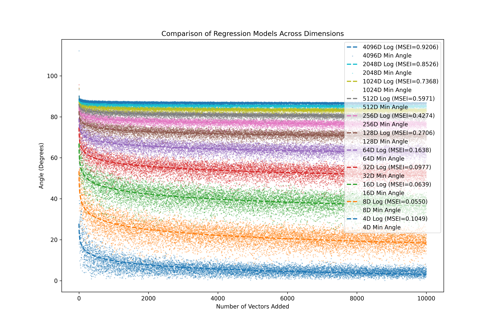
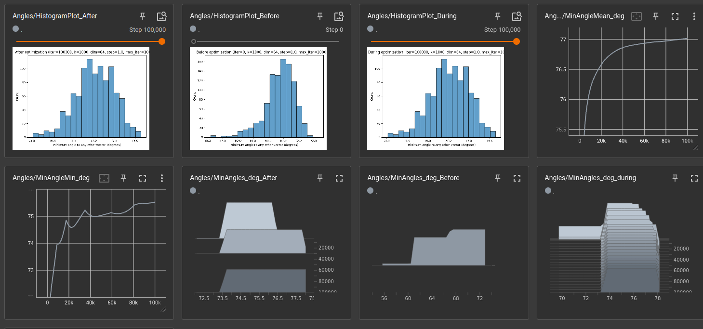

# Capacity Studies

This folder contains scripts for studying the concept capacity of higher
dimensional residual vectors.

##  Description of scripts

### Capacity scripts

These scripts measure the capacity of the vector during standard gaussian random
initialization with mean of 0.00 and standard deviation of 0.02

- `comparison_of_log_regression_cuda.py` - shows the minimum angle of a vector (y_axis below, in degrees) of dimension "d" with "x" prior vectors:

### Initialization scripts

These are scripts which work to move closer to 90-deg initialization.

