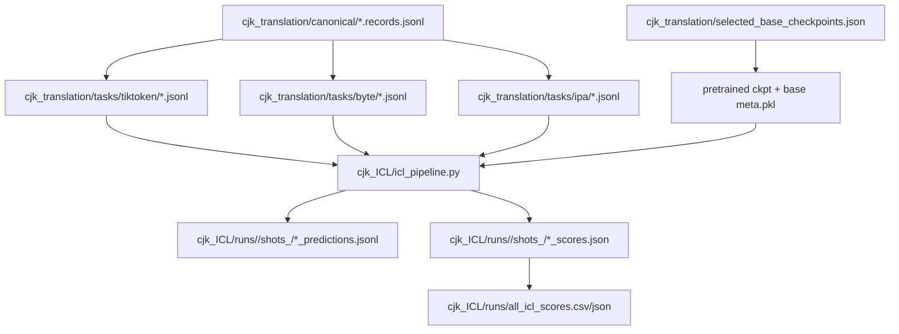
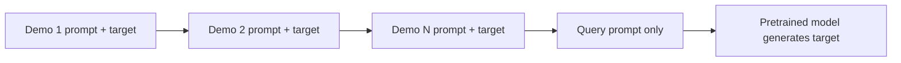
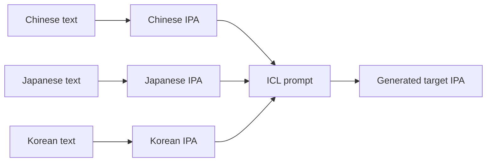
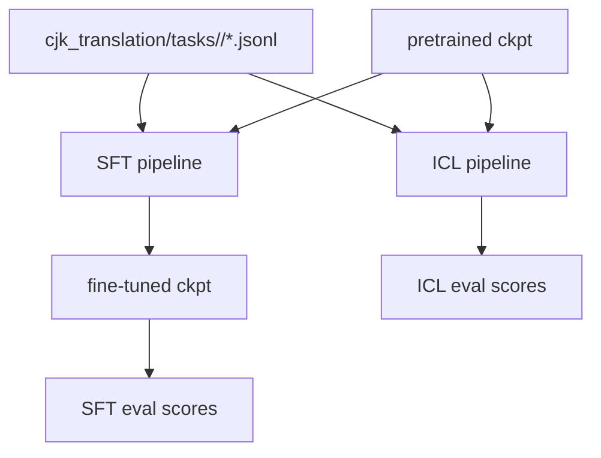

# CJK ICL Pipeline

### Goal

`cjk_ICL/` is an in-context-learning evaluation path parallel to the existing
`cjk_translation/` fine-tuning pipeline. It does not run SFT and does not use
fine-tuned checkpoints. Instead, it reads pretrained checkpoints from
`cjk_translation/selected_base_checkpoints.json` and evaluates CJK translation
with zero-shot, one-shot, or N-shot prompts.

Supported tokenizer families:

- `tiktoken`: orthographic prompt and orthographic target.
- `byte`: orthographic prompt and orthographic target, tokenized as UTF-8 bytes.
- `ipa`: IPA prompt and IPA target, i.e. `source IPA -> target IPA`.

### Directory Layout

```text
cjk_ICL/
  config.example.json      # Example ICL config
  icl_pipeline.py          # Main ICL generation/scoring/aggregation script
  run_icl_sweep.sh         # Bash entrypoint
  README.md                # Short usage notes
  PIPELINE.md              # This document
  runs/                    # Created after running
```

### Inputs

The ICL pipeline reuses existing CJK translation artifacts:



### Prompt Construction

The base query prompt is identical to the SFT task prompt:

```text
Translate the following sentence from {src_lang_name} to {tgt_lang_name}.
{src_label}: {src_text}
{tgt_label}:
```

`shot_counts` controls how many same-direction training examples are prepended:

- `0`: zero-shot, query only.
- `1`: one-shot, one demo before the query.
- `N`: N-shot, N demos before the query.

Each demo is formatted as:

```text
Translate the following sentence from Chinese to Japanese.
C: <source>
J: <target>

```

Overall N-shot structure:



Demo selection:

- Demos come from `cjk_translation/tasks/<family>/train.jsonl`.
- Demos must match the query `direction`.
- Selection is deterministic via a stable hash of `query id + shot_count`.
- If the prompt exceeds `block_size - max_new_tokens`, demos are dropped from
  the front by default while preserving the query.

### IPA Rule

IPA evaluation uses the native IPA-rendered tasks:



So:

- Source is IPA.
- In-context demo targets are IPA.
- References and scoring targets are IPA.
- The previous `source_only` IPA mode is intentionally not used here.

### Bash Entrypoint

Main entrypoint:

```bash
bash cjk_ICL/run_icl_sweep.sh
```

Common overrides:

```bash
FAMILIES="tiktoken byte ipa" \
SHOT_COUNTS="0 1 3" \
DEVICE=cuda \
DTYPE=bfloat16 \
bash cjk_ICL/run_icl_sweep.sh
```

Smoke run:

```bash
MAX_EXAMPLES=12 \
FORCE=1 \
FAMILIES="tiktoken byte ipa" \
SHOT_COUNTS="0 1" \
bash cjk_ICL/run_icl_sweep.sh
```

### Config Fields

Important fields in `config.example.json`:

| Field | Meaning |
| --- | --- |
| `data_dir` | Source CJK task directory |
| `out_dir` | ICL output directory, default `cjk_ICL/runs` |
| `selected_json` | Pretrained checkpoint selection manifest |
| `families` | Tokenizer families to evaluate |
| `model_variants` | Optional subset; empty means all matching selected variants |
| `shot_counts` | Number of ICL demonstrations, e.g. `[0, 1, 3]` |
| `eval_splits` | Canonical splits to evaluate, e.g. `dev/test` |
| `benchmark` | External benchmark CSV |
| `max_examples` | Optional sample limit for smoke/debug runs |
| `max_new_tokens` | Maximum generated tokens per example |
| `temperature` / `top_k` | Decoding parameters |
| `device` / `dtype` | Inference device and precision |
| `tiktoken_decode_mode` | `text` or `bytes`; default keeps the original text decode path |
| `drop_shots_over_block` | Drop demos if the prompt exceeds context length |

### Outputs

Each model variant and shot count gets a separate output directory:

```text
cjk_ICL/runs/<model_variant>/shots_<N>/
  prompt_config.json
  dev_predictions.jsonl
  dev_scores.json
  test_predictions.jsonl
  test_scores.json
  benchmark_easy_predictions.jsonl
  benchmark_easy_scores.json
```

Aggregate outputs:

```text
cjk_ICL/runs/all_icl_scores.csv
cjk_ICL/runs/all_icl_scores.json
cjk_ICL/runs/run_summary.json
```

### Relation to Fine-tuning



Key difference:

- SFT pipeline: fine-tune first, then evaluate the fine-tuned checkpoint.
- ICL pipeline: no training; evaluate pretrained checkpoints with in-context examples.
- Both use the same task JSONL files and scoring function, so their scores are comparable within each representation.

