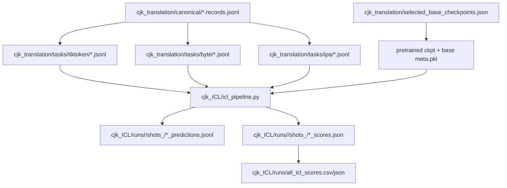
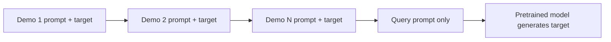
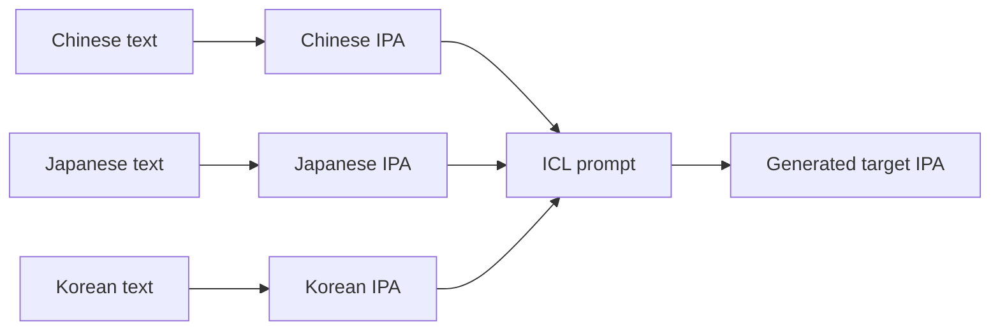
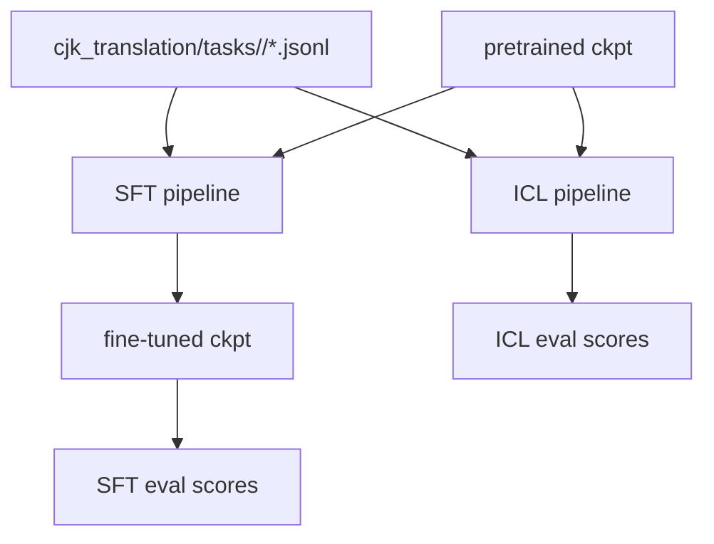

# CJK ICL Pipeline / CJK ICL 流程说明

## 中文版

### 目标

`cjk_ICL/` 是一个和 `cjk_translation/` fine-tuning pipeline 平行的 in-context learning 评测入口。它不做 SFT，不读取 fine-tuned checkpoint，而是直接读取 `cjk_translation/selected_base_checkpoints.json` 中选好的 pretrained checkpoints，然后用 zero-shot / one-shot / N-shot prompt 评测 CJK 三语互译任务。

支持三种 tokenizer family：

- `tiktoken`: 正字法文本 prompt 和正字法 target。
- `byte`: 正字法文本 prompt 和正字法 target，但模型 tokenizer 是 UTF-8 byte。
- `ipa`: IPA prompt 和 IPA target，即 `source IPA -> target IPA`。这里刻意不使用 `source IPA -> orthographic target`。

### 目录结构

```text
cjk_ICL/
  config.example.json      # ICL 默认配置示例
  icl_pipeline.py          # ICL 生成、打分、聚合主脚本
  run_icl_sweep.sh         # bash 入口
  README.md                # 简短入口说明
  PIPELINE.md              # 本文档
  runs/                    # 运行后生成；不提交也可以
```

### 数据和模型输入

ICL pipeline 复用已有 CJK translation 产物：



### Prompt 构造

基础 query prompt 和 SFT pipeline 完全一致：

```text
Translate the following sentence from {src_lang_name} to {tgt_lang_name}.
{src_label}: {src_text}
{tgt_label}:
```

`shot_counts` 决定 query 前面放多少个同方向 training examples：

- `0`: zero-shot，只放 query prompt。
- `1`: one-shot，放 1 个同方向 demo，再放 query prompt。
- `N`: N-shot，放 N 个同方向 demo，再放 query prompt。

demo 的格式是：

```text
Translate the following sentence from Chinese to Japanese.
C: <source>
J: <target>

```

完整 N-shot prompt 结构：



示例选择方式：

- 从 `cjk_translation/tasks/<family>/train.jsonl` 中取 demo。
- 只取和当前 query 相同 `direction` 的 demo。
- 用 `query id + shot_count` 做稳定 hash，保证选择可复现。
- 如果 prompt 超过模型 `block_size - max_new_tokens`，默认从最早的 demo 开始丢弃，保留 query。

### IPA 规则

IPA 模式固定使用 native IPA task：



这意味着：

- source 是 IPA。
- in-context demos 的 target 也是 IPA。
- reference / scoring target 也是 IPA。
- 不走之前额外评过的 `source_only` 模式。

### Bash 入口

主入口：

```bash
bash cjk_ICL/run_icl_sweep.sh
```

常用覆盖项：

```bash
FAMILIES="tiktoken byte ipa" \
SHOT_COUNTS="0 1 3" \
DEVICE=cuda \
DTYPE=bfloat16 \
bash cjk_ICL/run_icl_sweep.sh
```

小样本 smoke run：

```bash
MAX_EXAMPLES=12 \
FORCE=1 \
FAMILIES="tiktoken byte ipa" \
SHOT_COUNTS="0 1" \
bash cjk_ICL/run_icl_sweep.sh
```

### Config 字段

`config.example.json` 中关键字段：

| 字段 | 含义 |
| --- | --- |
| `data_dir` | 读取 `cjk_translation/` 任务数据的位置 |
| `out_dir` | ICL 输出目录，默认 `cjk_ICL/runs` |
| `selected_json` | pretrained checkpoint 选择清单 |
| `families` | 要跑的 tokenizer family |
| `model_variants` | 可选；为空表示跑所选 family 的全部 variants |
| `shot_counts` | ICL demo 数量，例如 `[0, 1, 3]` |
| `eval_splits` | 要评测的 canonical split，例如 `dev/test` |
| `benchmark` | 外部 benchmark CSV |
| `max_examples` | 可选；smoke/debug 时限制样本数 |
| `max_new_tokens` | 每条生成最大 token 数 |
| `temperature` / `top_k` | decoding 参数 |
| `device` / `dtype` | 推理设备和精度 |
| `tiktoken_decode_mode` | `text` 或 `bytes`；默认保持原始 text decode |
| `drop_shots_over_block` | 超过上下文长度时是否丢弃 demo |

### 输出

每个 model variant 和 shot count 会生成一个独立目录：

```text
cjk_ICL/runs/<model_variant>/shots_<N>/
  prompt_config.json
  dev_predictions.jsonl
  dev_scores.json
  test_predictions.jsonl
  test_scores.json
  benchmark_easy_predictions.jsonl
  benchmark_easy_scores.json
```

聚合输出：

```text
cjk_ICL/runs/all_icl_scores.csv
cjk_ICL/runs/all_icl_scores.json
cjk_ICL/runs/run_summary.json
```

### 和 fine-tuning pipeline 的关系



差异：

- SFT pipeline: 先 fine-tune，再评测 fine-tuned checkpoint。
- ICL pipeline: 不训练，直接给 pretrained checkpoint 拼 in-context prompt。
- 两者复用同一批 task JSONL 和同一套 score function，便于横向比较。

---

## English Version

### Goal

`cjk_ICL/` is an in-context-learning evaluation path parallel to the existing
`cjk_translation/` fine-tuning pipeline. It does not run SFT and does not use
fine-tuned checkpoints. Instead, it reads pretrained checkpoints from
`cjk_translation/selected_base_checkpoints.json` and evaluates CJK translation
with zero-shot, one-shot, or N-shot prompts.

Supported tokenizer families:

- `tiktoken`: orthographic prompt and orthographic target.
- `byte`: orthographic prompt and orthographic target, tokenized as UTF-8 bytes.
- `ipa`: IPA prompt and IPA target, i.e. `source IPA -> target IPA`.

### Directory Layout

```text
cjk_ICL/
  config.example.json      # Example ICL config
  icl_pipeline.py          # Main ICL generation/scoring/aggregation script
  run_icl_sweep.sh         # Bash entrypoint
  README.md                # Short usage notes
  PIPELINE.md              # This document
  runs/                    # Created after running
```

### Inputs

The ICL pipeline reuses existing CJK translation artifacts:


### Prompt Construction

The base query prompt is identical to the SFT task prompt:

```text
Translate the following sentence from {src_lang_name} to {tgt_lang_name}.
{src_label}: {src_text}
{tgt_label}:
```

`shot_counts` controls how many same-direction training examples are prepended:

- `0`: zero-shot, query only.
- `1`: one-shot, one demo before the query.
- `N`: N-shot, N demos before the query.

Each demo is formatted as:

```text
Translate the following sentence from Chinese to Japanese.
C: <source>
J: <target>

```

Overall N-shot structure:


Demo selection:

- Demos come from `cjk_translation/tasks/<family>/train.jsonl`.
- Demos must match the query `direction`.
- Selection is deterministic via a stable hash of `query id + shot_count`.
- If the prompt exceeds `block_size - max_new_tokens`, demos are dropped from
  the front by default while preserving the query.

### IPA Rule

IPA evaluation uses the native IPA-rendered tasks:


So:

- Source is IPA.
- In-context demo targets are IPA.
- References and scoring targets are IPA.
- The previous `source_only` IPA mode is intentionally not used here.

### Bash Entrypoint

Main entrypoint:

```bash
bash cjk_ICL/run_icl_sweep.sh
```

Common overrides:

```bash
FAMILIES="tiktoken byte ipa" \
SHOT_COUNTS="0 1 3" \
DEVICE=cuda \
DTYPE=bfloat16 \
bash cjk_ICL/run_icl_sweep.sh
```

Smoke run:

```bash
MAX_EXAMPLES=12 \
FORCE=1 \
FAMILIES="tiktoken byte ipa" \
SHOT_COUNTS="0 1" \
bash cjk_ICL/run_icl_sweep.sh
```

### Config Fields

Important fields in `config.example.json`:

| Field | Meaning |
| --- | --- |
| `data_dir` | Source CJK task directory |
| `out_dir` | ICL output directory, default `cjk_ICL/runs` |
| `selected_json` | Pretrained checkpoint selection manifest |
| `families` | Tokenizer families to evaluate |
| `model_variants` | Optional subset; empty means all matching selected variants |
| `shot_counts` | Number of ICL demonstrations, e.g. `[0, 1, 3]` |
| `eval_splits` | Canonical splits to evaluate, e.g. `dev/test` |
| `benchmark` | External benchmark CSV |
| `max_examples` | Optional sample limit for smoke/debug runs |
| `max_new_tokens` | Maximum generated tokens per example |
| `temperature` / `top_k` | Decoding parameters |
| `device` / `dtype` | Inference device and precision |
| `tiktoken_decode_mode` | `text` or `bytes`; default keeps the original text decode path |
| `drop_shots_over_block` | Drop demos if the prompt exceeds context length |

### Outputs

Each model variant and shot count gets a separate output directory:

```text
cjk_ICL/runs/<model_variant>/shots_<N>/
  prompt_config.json
  dev_predictions.jsonl
  dev_scores.json
  test_predictions.jsonl
  test_scores.json
  benchmark_easy_predictions.jsonl
  benchmark_easy_scores.json
```

Aggregate outputs:

```text
cjk_ICL/runs/all_icl_scores.csv
cjk_ICL/runs/all_icl_scores.json
cjk_ICL/runs/run_summary.json
```

### Relation to Fine-tuning


Key difference:

- SFT pipeline: fine-tune first, then evaluate the fine-tuned checkpoint.
- ICL pipeline: no training; evaluate pretrained checkpoints with in-context examples.
- Both use the same task JSONL files and scoring function, so their scores are comparable within each representation.

